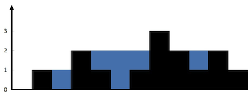

# 16. Trapping Rain Water

**Link:** [Trapping Rain Water](https://leetcode.com/problems/trapping-rain-wate)

**Difficulty:** Hard

**Topics:** Array, Two Pointers, Dynamic Programming, Stack, Monotonic Stack

## Problem Description

Given `n` non-negative integers representing an elevation map where the width of each bar is `1`, compute how much water it can trap after raining.

### Constraints:

* $n == height.length$
* $1 \leq n \leq 2 \times 10^4$
* $0 \leq height[i] \leq 10^5$

### Example



* **Input:** height = [0,1,0,2,1,0,1,3,2,1,2,1]
* **Output:** 6
* **Explanation:** The above elevation map (black section) is represented by array [0,1,0,2,1,0,1,3,2,1,2,1]. In this case, 6 units of rain water (blue section) are being trapped.

## Solution approach

Positions can trap water only if taller bars exist both sides. So the water trapped at current position `i` depends on `min(max left height, max right height) - current height`. 

## Brute Force Solution

The brute force solution would be, for each element, find the right and left max through a loop. This would take $O(n^2)$.

## Optimal Solution

There are two time efficient ways of calculating this.

1. Using prefix and suffix arrays to pre-calculate and store the left and right max. This takes $O(n)$ space. 
2. The optimal solution is to use a two-pointer approach to keep track of the running maxes both sides. This is only $O(1)$ space. 

```c++
class Solution {
public:
    int trap(vector<int>& height) {
        int length = height.size();
        int rain = 0;
        int i = 0, j = length - 1;
        int lmax = height[0], rmax = height[length - 1];
        while (i < j) {
            if (lmax <= rmax) {
                rain += lmax - height[i];
                i++;
                lmax = max(lmax, height[i]);
            }
            else {
                rain += rmax - height[j];
                j--;
                rmax = max(rmax, height[j]);
            }
        }
        return rain;
    }
};
```

### Complexity

* **Time Complexity:** $O(n)$
* **Space Complexity:** $O(1)$